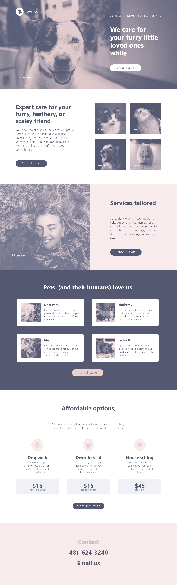

# Página simple de marketing
Este es un ejemplo de página web simple desarrollada con HTML5, CSS3 y SASS (sin funcionalidades)

## Introduction
Este sitio se desarrolló como parte de un proyecto personal. Contiene la estructura de una página web simple en HTML5 utilizando diferentes etiquetas y código CSS3 y SASS para su correcta visualización. Se realizó basándome en un diseño descargado desde [Behance](https://www.behance.net/gallery/62932019/Pawtastic-UI-Kit-for-Adobe-XD)

El HTML está estructurado de modo que cada parte del código queda agrupado en su sección correspondiente. Para esto se utilizaron encabezados, enlaces (sin operacion) dentro de la barra de navegación, divs, párrafos, sections, botones, etc.

[Visitar]

## Tecnologías

Para la elaboración de este sitio únicamente se utilizó:

* HTML5 - Sin el uso de frameworks
* CSS3 - Programado bajo un esquema de módulos
* SASS

A este proyecto se le integraron [Normalize] para resetear los estilos por default de los browsers, iconos svg y fuentes de [Google Fonts]

## License

GNU GENERAL PUBLIC LICENSE

[//]: # (These are reference links used in the body of this note and get stripped out when the markdown processor does its job. There is no need to format nicely because it shouldn't be seen. Thanks SO - http://stackoverflow.com/questions/4823468/store-comments-in-markdown-syntax)
   
   [Visitar]: <https://cmjdesarrollo.github.io/DisenoScss/>
   [Normalize]: <https://necolas.github.io/normalize.css/>
   [Google Fonts]: <https://fonts.google.com/>
